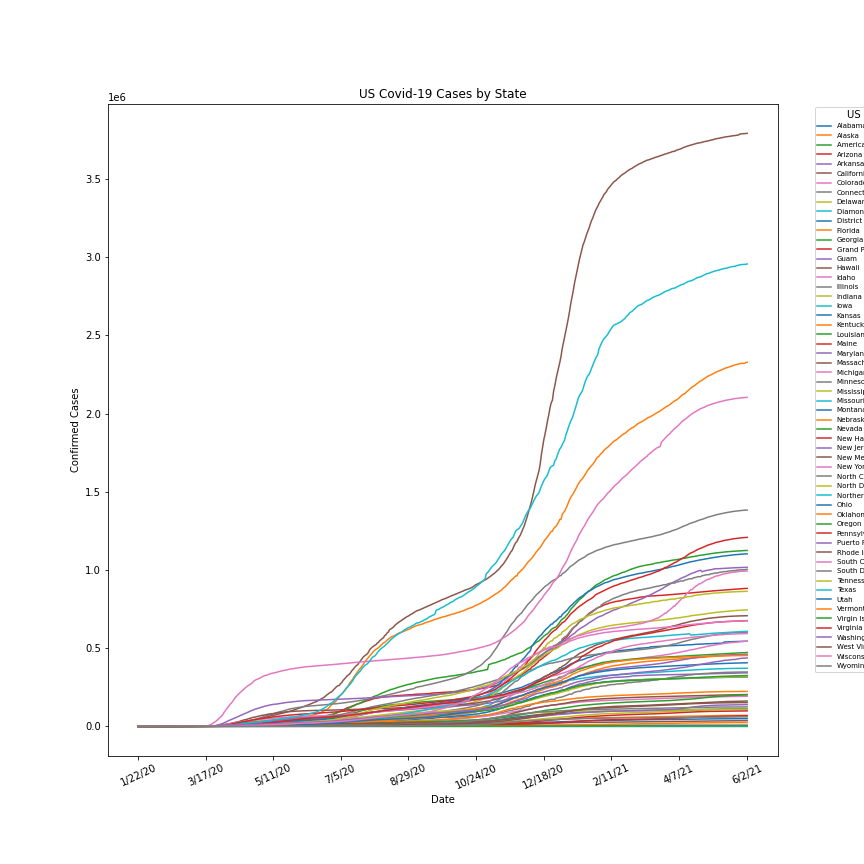
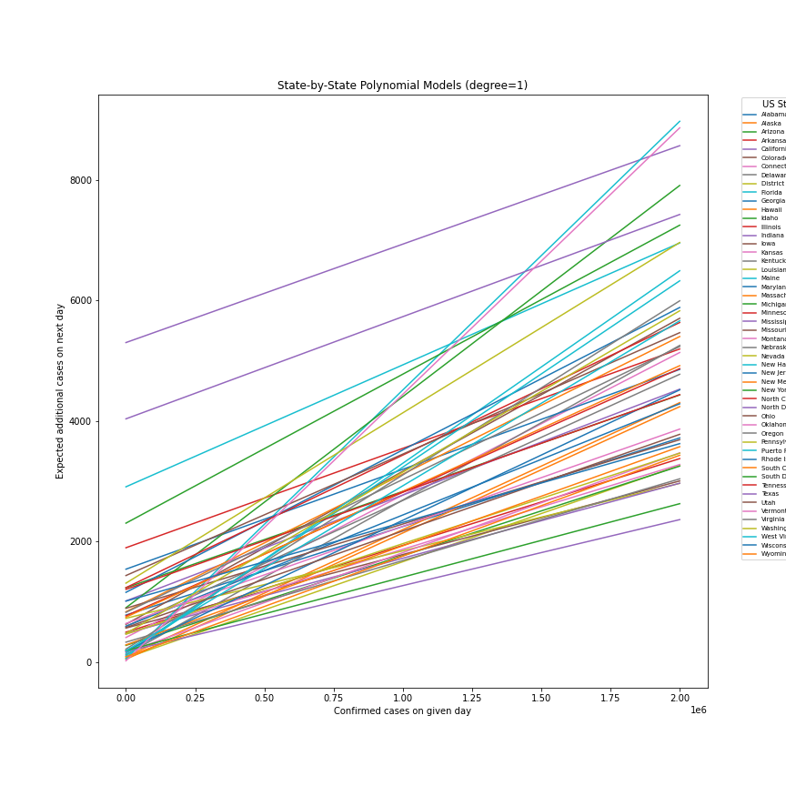
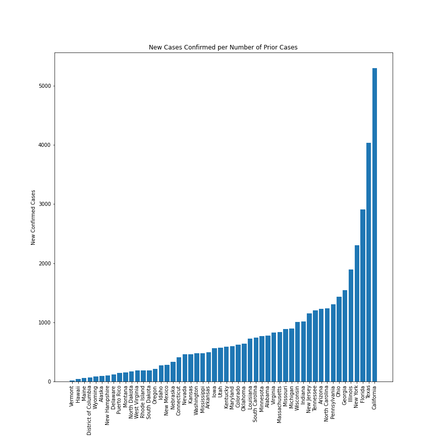

Name: Spencer Fitch \
Netid: slf0232

# Comp_Sci 349 - Final Option 1
For this final assignment, I chose to do some analysis on the provided coronavirus data. Specifically, I wanted to analyze the US time series data on a state-by-state level in order to determine if I could find any noteable patterns or differences between the states. The jupyter notebook used to create these results can be accessed at the following link: https://github.com/s-fitch/coronavirus-2020/blob/master/experiments.ipynb

 

My first step in this analysis was to aggregate the US time series data ("time_series_covid19_confirmed_US.csv") by state, as it initially is broken down into several metropolitan areas within each state. After doing that, I plotted this aggregated time series data using matplotlib, as seen above. In this, we can see that certain states, like California and Texas, have much higher totals than that of other states like Wyoming and Alaska. This is what we would expect when looking at the raw numerical data, as states like California and Texas are much more urbanized with dense city centers than their more rural counterparts in Wyoming and Alaska. We can also see synchronous rises in case totals around the holiday season (November-January) for all states, which is to be expected as large portions of the country traveled to meet with families for the holidays. We also see a smaller syncrhonous spike around early June to mid July in 2020, which coincides with the initial relaxation of covid guidelines in several states.

 

With this now aggregated data, I moved onto generating a predictive model. For this, I created one model for each state that would use the number of confirmed cases on a given day to predict the number of newly confirmed cases added on the next day. I only generated models for states who had a maximum total case count over 20,000, as any less than that appeared to have data which was too noisy to generate a meaningful model. To create the models, I used np.polyfit with degree=1 to model this, where X=*number of cases* and Y=*np.diff(cases)*. I tried several different degrees in my analysis, but they all resulted in poor results overall that diverged off into extreme values. Additionally, the logical interpretation of the data relationships would indicate that it should be modeled by a degree=1 polynomial, which appears to corroborate the earlier findings through testing different degrees. Because the models use the number of cases observed as the independent variable, the analysis is now independent of the actual dates the values were observed on and is only concerned with the the number of cases that were observed. This way, I am able to compare the results between the states in a time-independent manner while still being able to predict future case counts for each state individually. The models generated using this method can be seen graphed above over a range of case totals. As we can see, certain states have much steeper slopes than others over the span of the graph, signaling greater propensity for virus spreading by each additional case. This phenonemon is explored more in depth with the next plot.

 

The bar graph above was used in order to compare the slopes of the different models. The conceptual interpretation of this slope measure is that it is the increase in new cases observed for every increase in today's cases observed. A state for which this value is high will see greater increases in infection spread for each new case confirmed, essentially correlating with faster propogation of the virus. According to this measure, urbanized states like California, New York, and Illinois, have a greater propensity for spreading the virus than rural states like Wyoming and Alaska. However, this is not always the case, as we can see more rural states like North Carolina and Wisconsin having relatively high infection rates, while urban states like Washington DC and Rhode Island have relatively low infection rates for their urban level. From this we can see that urbanization and overall population levels are not the sole determining factor in the virus's propensity for spreading. This could be caused by the resident's adherence to covid regulations, as states with abnormally high slopes, like Wisconsin and Tennessee, were notorious during the pandemic for having residents not adhere to covid guidelines and observing resulting spikes in their case totals.